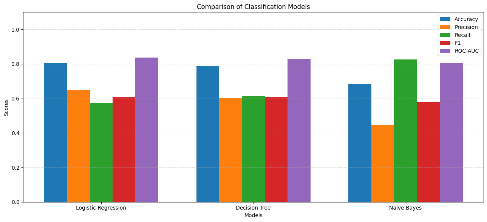
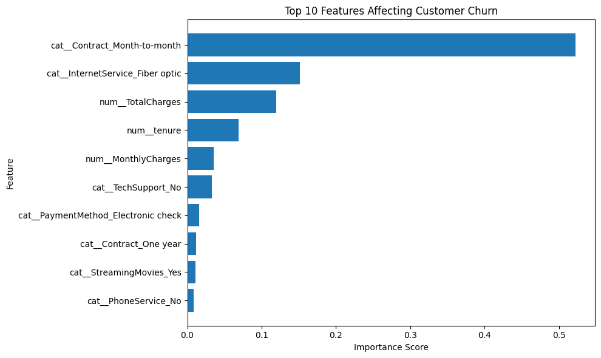

###### Telco Customer Churn Prediction

###### A machine learning project that predicts customer churn in a telecom company using classification algorithms and data preprocessing techniques. The project compares multiple models and evaluates their performance using standard classification metrics.

###### 

###### Dataset

###### \* Dataset: IBM Telco Customer Churn Dataset

###### \* Source: Kaggle

###### \* Records: 7,043 customers

###### \* Features: 20 customer attributes

###### \* Target Variable: Churn (Yes/No)

###### \* Churn Rate: Approximately 26%

###### 

###### Project Objectives

###### \* Predict whether a customer is likely to churn.

###### \* Compare the performance of multiple classification algorithms.

###### \* Identify the most influential factors affecting customer churn.

###### \* Visualize model performance and feature importance.

###### 

###### Data Preprocessing

###### \* Handled missing values in the `TotalCharges` column.

###### \* Converted target labels into numerical format.

###### \* Applied One-Hot Encoding to categorical features.

###### \* Standardized numerical features using StandardScaler.

###### \* Performed stratified train-test splitting.

###### 

###### Machine Learning Models

###### 1\. Logistic Regression

###### 2\. Decision Tree Classifier

###### 3\. Gaussian Naive Bayes

###### 

###### Evaluation Metrics

###### \* Accuracy

###### \* Precision

###### \* Recall

###### \* F1 Score

###### \* Confusion Matrix

###### 

###### Results

###### | Model               | Accuracy |

###### | ------------------- | -------- |

###### | Logistic Regression | 80.38%   |

###### | Decision Tree       | 78.96%   |

###### | Naive Bayes         | 70.08%   |

###### 

###### \*\*Best Performing Model:\*\* Logistic Regression (80.38% Accuracy)

###### 

###### Visualizations

###### \* Confusion Matrix for each model

###### \* Model Performance Comparison Graph

###### \* Feature Importance Analysis

###### 

###### Technologies Used

###### \* Python

###### \* Pandas

###### \* NumPy

###### \* Matplotlib

###### \* Seaborn

###### \* Scikit-Learn

###### 

###### Project Structure

###### customer-churn-prediction/

###### │

###### ├── Telco-Customer-Churn.csv

###### ├── churn\_prediction.py

###### ├── requirements.txt

###### ├── README.md

###### ├── model\_comparison.png

###### └── feature\_importance.png

###### 

## Installation

```bash
git clone https://github.com/AmruthaRaju24/telco-churn-prediction.git
cd telco-churn-prediction
pip install -r requirements.txt
```

## Running the Project

```bash
python churn_prediction.py
```

## Model Comparison



## Feature Importance



